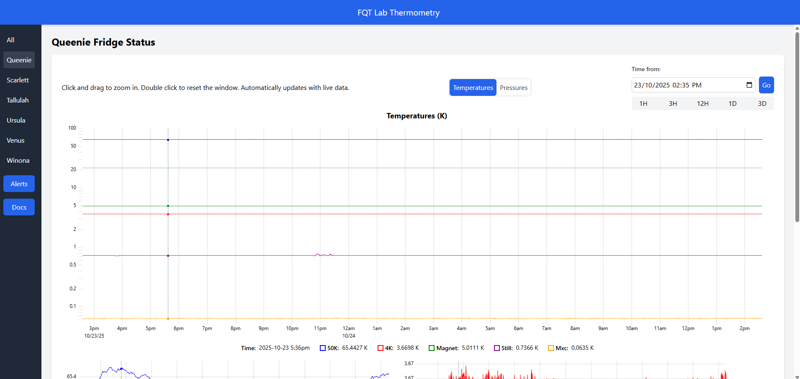
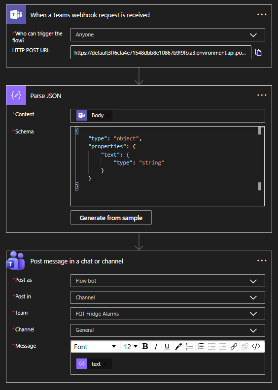

# FQT Thermometry

**View here http://status.fqt.unsw.edu.au**
(Must be on the UNSW VPN)

A website that shows the status of multiple Bluefors fridges allowing centralised monitoring. Also contains an alert system that sends Teams messages if fridge anomalies are detected so that action can be taken rapidly.



Created for the Morello Fundamental Quantum Technologies (FQT) group originally, but should be extendable to other systems!

## Run

0) Dependencies are managed using `uv`. Install from https://docs.astral.sh/uv/.
1) First copy `config.example.py` to `config.py` and add the desired values. Do the same for `config.example.yaml` for the alerts system.
2) Make sure that a PostgreSQL database has been created with TimescaleDB extension and database `thermometry`. See below for additional commands of how to do this.
3) Build the listener application and deploy it on the BlueFors fridge computer. See instructions below.
3) Run the website and alerts.


To run the website: `uv run website` or the alert system `uv run alerts` or to run both simultaneously `uv run all`.

To build the listener application:`uv run build-listener`. See more instructions below.

To build the watchdog application: `uv run build-watchdog` (which monitors the status of the website and sends a Teams message if it goes down)

For production you really shouldn't run this on port=80. Instead run this on port=5000 and use a reverse proxy such as nginx running on port 80.

### Other database commands
First install the TimescaleDB extension to the PostgreSQL database. This just is optimised for time series data and makes retriving data faster. Instructions to install this are found https://docs.tigerdata.com/self-hosted/latest/install/

Next you need to create the `thermometry` table. Do this using SQL via
```bash
sudo -u postgres psql -c "CREATE DATABASE thermometry"
```

To adjust the database by adding sensors and fridges use the following click commands.
All must be run with the format `uv run -- flask --app thermometry.flaskr <COMMAND>` where `<COMMAND>` can be any of the following.

- `init-db` create the default database from `schema.sql`
- `create-default-fridges` adds the fridges and sensors used by FQT. See `src/thermometry/flaskr/db.py:create_default_fridges` for a guide of how to add custom fridges using a python function. Alternatively run the following commands:
- `add-fridge <name>` adds a named fridge and returns the fridge ID
- `add-sensor <name> <fridge ID> <latest>` adds a named sensor to a given fridge. `latest` is a boolean flag of `0` or `1` if only the latest result should be recorded or if historic values should be kept. 
- `create-dummy-data` is an internal method used for testing the database with some fake data

Make sure to initialise the database before continuing to run the website.
Finally, everything is just postgresql.... you can simply edit the database if that is easier. I recommend pgAdmin for a graphical interface.

### Building the listener application
To build a `.exe` executable to deploy on a fridge computer use `uv run build-listener`.

Alternatively you may want to deploy this on an old Windows system (although who doesn't update their computers..?). Specifically Windows 7 only supports Python <3.8 which you can specifically ask uv to build at by transiently injecting dependencies on the fly.
```bash
uv run --no-project --python 3.8 --with PyInstaller --with requests --with pyyaml --with python-dateutil src/listener/main.py
```

Deployment of this application needs a `fridge.yaml` file present in the same directory.
See `src/listener/fridge.yaml` for an example configuration for reading the BlueFors logs.

### Setting up the Teams webhook
The alerts system is designed to automatically post a Teams message to a channel whenever an alarm is triggered. Doing this requires setting up an automation in the Workflows application. Create a flow matching the template below.




### Basic Schematic
A basic schematic of how the system works with multiple fridges is shown below. Note that the internal alert system is not shown.


