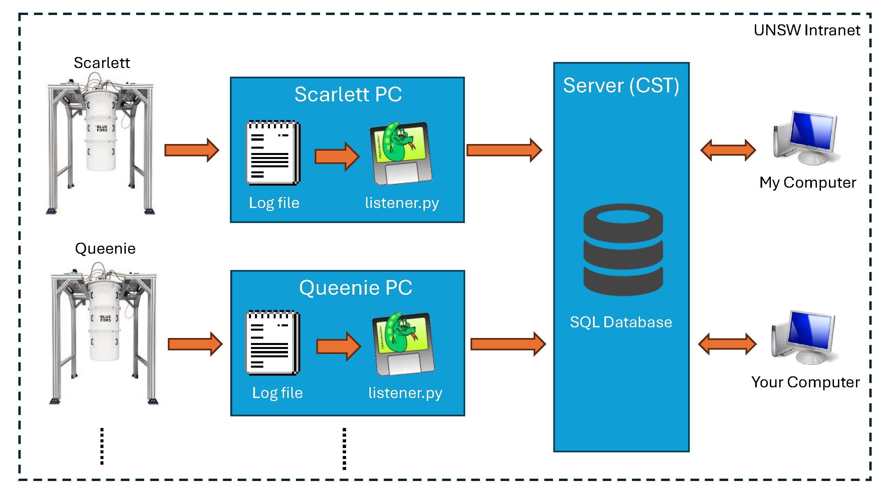

# View here http://129.94.115.104/dashboard/?
(Must be on UNSW VPN)

## TODO
- Change date selector to instead be 1 DAY, 3 DAY, 7 DAYS

- Add a secret key required to add new logs to the dashboard (prevent incorrect readings)
- Adjust HTML/CSS to work on mobile (low priority)
- Add all the fridges
- Add log scale for P1 
- When below 50mK use mK instead of K
- Add buttons for last 3 days or day 
- Prevent requesting data from more than 7 days and change default to 3 days
- Add VACUUM feature to the database to reduce it's size
- Adjust /api/latest to grab fridge/sensor data from parameters instead of body
- Change POST requests to GET requests (as they do not modify the database)

## Potential ideas
- Plot the difference between P3 and P4 to determine if the traps are getting clogged
- Add a webhook to teams to alert if the mixing chamber rises in temperature
- Duplicate the database on a remote server to allow access without using the UNSW VPN

